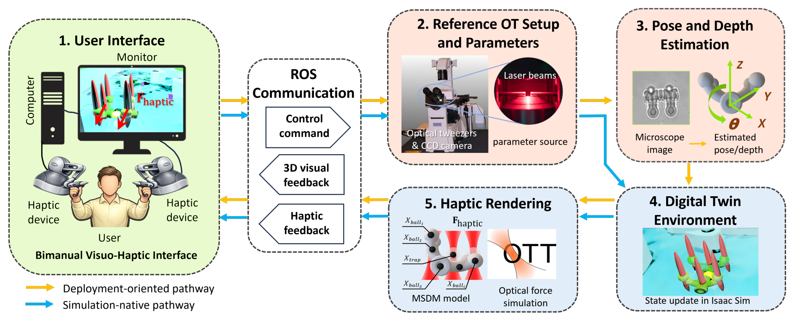
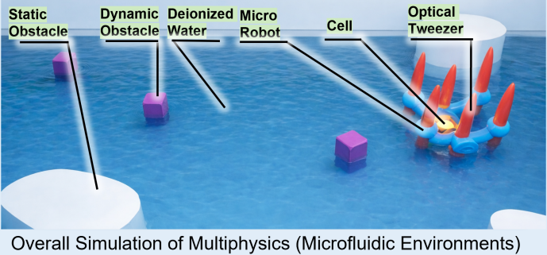
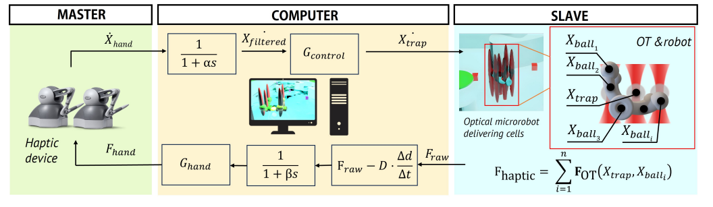
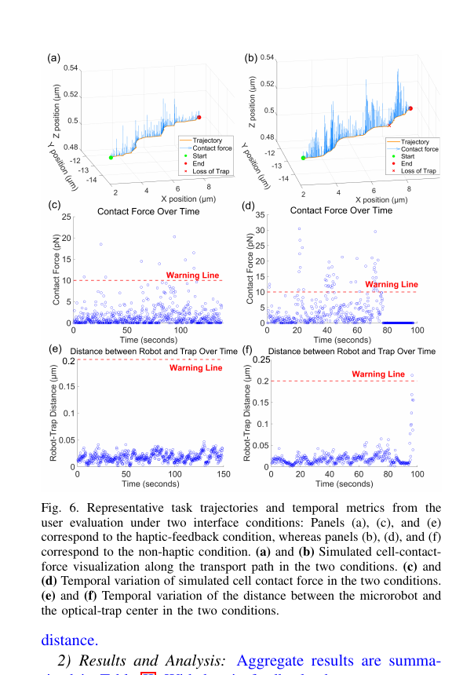

# A Digital Twin Framework for Virtual Visuo-Haptic Teleoperation of Complex-Shaped Optical Microrobots


<p align="center">
  <a href="https://drive.google.com/file/d/1TxAtb-vB2ncwe8-VzINXJNkIC708ikQt/view?usp=sharing"></a>
  <a href="https://zongcai23.github.io/digital-twin-visuo-haptic/"></a>
  <a href="https://drive.google.com/file/d/1mpAjNmRjuYFRDYTJD2euEBR9yDKwae_z/view?usp=sharing"></a>
</p>

<p align="center"><strong>Zongcai Tan</strong>, <strong>Lan Wei</strong>, <strong>Dandan Zhang</strong></p>
<p align="center">Imperial College London</p>

<!--
**Zongcai Tan, Lan Wei, Dandan Zhang**  
Imperial College London


This repository contains a **clean public release for the haptic teleoperation side** of our digital-twin framework for optical microrobots. The release consists of 3 parts: a short paper-level overview, a compact code map, and a practical tutorial that explains how to build and run the haptic interface and how to connect it to a simulator / digital twin.
-->
This repository contains a **clean public release for our digital-twin framework for optical microrobots**, with an emphasis on the visuo-haptic teleoperation interface and the pose-and-depth estimation module used for deployment-oriented reconstruction. The release consists of a short paper-level overview, a compact code map, and practical tutorials for both the haptic interface and the perception pipeline.

For the broader digital-twin simulator and the **ROS 2 / reinforcement-learning deployment version**, please also refer to our companion repository `ICRA2025-OT-Gym`.

At a glance, the framework combines five connected blocks:

**bimanual Geomagic interface → ROS communication → OT parameter / state input → Isaac Sim digital twin → model-based haptic rendering**

## Pipeline overview



## What this repository includes

### 1. Bimanual haptic interface and ROS bridge
The `geomagic_control` package contains the ROS interface for the Geomagic Touch devices, including the low-level device node, custom messages, launch files, and a force-feedback node.

### 2. Digital twin integration contract
This release keeps the topic-level interface that the simulator is expected to satisfy. In the current setup, the force publisher consumes OT / robot TF topics such as `/firstOTposition`, `/secondOTposition`, `/robot01`, `/robot02`, and `/xform`.

### 3. Model-based haptic rendering
The haptic rendering logic is implemented in `force_pub.py`. The node reads simulator state, computes a filtered force cue, and publishes `DeviceFeedback` messages to the Geomagic device namespace.

<!--
### 4. Pose and depth estimation slot
A dedicated `code/vision/` folder is prepared for the perception module used in the paper. The public release keeps the repository structure and documentation ready for that module without pretending to release code that is not yet included.
-->

### 4. Pose and depth estimation
The `code/vision/Pose_and_Depth.ipynb` notebook provides a step-by-step perception pipeline for microscope-image-based pose prediction and depth estimation. It serves as the deployment-oriented perception entry point for digital-twin alignment described in the paper.
## Key figures

### Digital twin scene


### Control and signal flow


<!--
### Representative user-study results

-->

## Code map

### Haptic module
- `code/haptic/geomagic_touch_ws/src/geomagic_control/src/device_node.cpp`  
  Low-level ROS interface for the Geomagic Touch device.

- `code/haptic/geomagic_touch_ws/src/geomagic_control/scripts/force_pub.py`  
  Filtered force rendering and smoothed twist publishing.

- `code/haptic/geomagic_touch_ws/src/geomagic_control/msg/DeviceFeedback.msg`  
  Force-feedback message used by the Geomagic node.

- `code/haptic/geomagic_touch_ws/src/geomagic_control/msg/DeviceButtonEvent.msg`  
  Button-event message.

- `code/haptic/geomagic_touch_ws/src/geomagic_control/launch/left_device.launch`  
  Left-hand launch entry mapped to `/firstOTposition` and `/robot01`.

- `code/haptic/geomagic_touch_ws/src/geomagic_control/launch/right_device.launch`  
  Right-hand launch entry mapped to `/secondOTposition` and `/robot02`.

- `code/haptic/geomagic_touch_ws/src/geomagic_control/launch/dual_device_demo.launch`  
  Convenience launch file for starting both devices.
<!--
### Vision slot
- `code/vision/README.md`  
  Notes on how to place the pose/depth notebook and checkpoints into the repository later.
-->
### Vision module
- `code/vision/Pose_and_Depth.ipynb`  
  Step-by-step notebook for pose prediction and depth estimation from microscope images.

- `code/vision/README.md`  
  Module notes, usage instructions, and expected folder layout for the perception pipeline.

## Quick start

### Build the ROS workspace
```bash
cd code/haptic/geomagic_touch_ws
catkin_make
source devel/setup.bash
```

### Start ROS
```bash
roscore
```

### Launch both haptic devices
```bash
roslaunch geomagic_control dual_device_demo.launch
```

### Inspect the main topics
```bash
rostopic list | grep Geomagic
rostopic echo /GeomagicLeft/smoothed_twist
rostopic echo /GeomagicRight/smoothed_twist
```

## Tutorials
- [`tutorials/01_prerequisites.md`](tutorials/01_prerequisites.md)
- [`tutorials/02_build_and_run_haptic_interface.md`](tutorials/02_build_and_run_haptic_interface.md)
- [`tutorials/03_connect_to_simulator_or_isaacsim.md`](tutorials/03_connect_to_simulator_or_isaacsim.md)
<!--
- [`tutorials/04_repository_customisation.md`](tutorials/04_repository_customisation.md)
-->
## Repository structure

```text
ot-haptic-feedback-digital-twin/
├── README.md
├── LICENSE
├── THIRD_PARTY_NOTICE.md
├── .gitignore
├── assets/
│   └── figures/
│       ├── framework_overview.png
│       ├── digital_twin_scene.png
│       ├── control_signal_flow.png
│       └── user_study_results.png
├── code/
│   ├── haptic/
│   │   ├── README.md
│   │   └── geomagic_touch_ws/
│   │       └── src/
│   │           ├── CMakeLists.txt
│   │           ├── geomagic_control/
│   │           └── geomagic_description/
│   └── vision/
│       └── README.md
├── tutorials/
│   ├── 01_prerequisites.md
│   ├── 02_build_and_run_haptic_interface.md
│   ├── 03_connect_to_simulator_or_isaacsim.md
│   └── 04_repository_customisation.md
└── paper/
    └── MARSS2026_digital_twin_visuohaptic.pdf
```
<!--
## Practical note
This repository is intentionally **not** a GitHub Pages website. It is a standard paper-code repository that you can upload directly to GitHub and cite using the repository link itself.

## Citation
If you find this repository useful, please cite the corresponding paper.
-->
